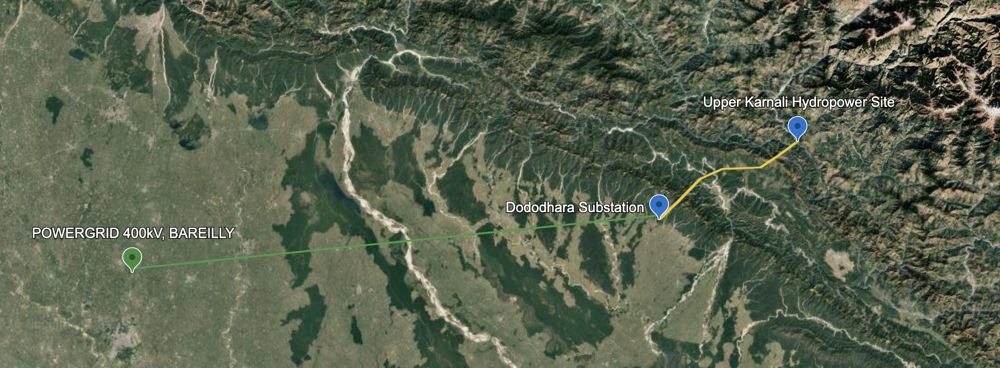
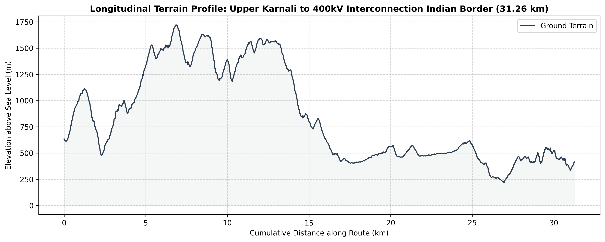

# Upper Karnali Hydropower - Transmission Lines Study
Designing a hypothetical 50km, 400kV double-circuit transmission network for cross-border energy trade from the Upper Karnali Hydropower site in Western Nepal to the Indian border using Python-driven terrain, structural, and electrical simulation.

 

## Table of Contents
* [Background](#Background)
    * [The Upper Karnali Hydropower Site](#The-Upper-Karnali-Hydropower-Site)
    * [Power Transmission and Off-take](#Power-Transmission-and-Off-take)
* [Purpose](#Purpose)
* [Simulation and Analysis](#Simulation-and-Analysis)
    * [Terrain Intake and Routing Strategy](#Terrain-Intake-and-Routing-Strategy)
    * [Conductor Selection and Sag-Tension Modelling](#Conductor-Selection-and-Sag-Tension-Modelling)
    * [Automated Tower Spotting](#Automated-Tower-Spotting)
    * [Verification](#Verification)
* [Conclusion](#Conclusion)

## Background
The far-western regions of Nepal (Sudurpaschim and Karnali Provinces) are widely regarded as the least developed in the country due to the challenging geography, harsh climates, leading to isolation and high rates of poverty. However, these regions have huge hydropower potential due to rivers like Karnali and Mahakali, which are relatively unharnessed. Building infrastructure, particularly transmission lines, is a critical part of harnessing and delivering electricity in the region, and generating interest and investments for such large-scale projects. If these projects and transmission networks are successfully established, there is hope for socio-economic benefits for people in the region including industrialization, digital inclusion, revenue from cross-border trade, and economic opportunities for locals.

### The Upper Karnali Hydropower Site
> The Upper Karnali Storage Hydropower Project is a proposed run-of-the-river hydroelectric plant on the Karnali river in West Nepal. It will have an installed capacity of 900 MW, making it the largest hydropower plant in Nepal when achieved [...] most of the generated power is set to be exported to both Bangladesh (about 500 MW) and India (another 292 MW), via a 400 kV double circuit transmission line, with the only remaining 108 MW of total power dedicated to local consumption.

> _Source: https://en.wikipedia.org/wiki/Upper_Karnali_Hydropower_Project_

 

 

_Maps from [Global Energy Monitor](https://globalenergymonitor.org/projects/global-hydropower-tracker?popup=3644)_

### Power Transmission and Off-take:
The power generated by the Upper Karnali hydropower project will be transmitted to the North East West Northern Eastern (NEWNE) India grid through a 400kV double-circuit transmission line. The 400kV export power is expected to be transmitted to the pooling station at Bareilly in Uttar Pradesh, owned by Power Grid Corporation of India (PGCIL). Nepal is entitled to receive 12% free power from the total power generated by the project, while 56% will be sold to Bangladesh under a long-term power purchase agreement (PPA). The remaining 32% will be sold to India under short-term/mid-term/long-term bilateral purchase agreements.

_Source: https://web.archive.org/web/20221023231005/https://www.nsenergybusiness.com/projects/upper-karnali-hydropower-project-nepal/_

## Purpose
The purpose of this study is to design a	100 km 400 kV double-circuit transmission line (up to the Nepal-India border) connecting the power generated at the Upper Karnali hydropower site to the Indian grid.

## Simulation and Analysis
The simulations will be performed using python (with the help of libraries like rasterio, numpy, matplotlib, shapely, and pyproj). The program will try to mimic the logic of industry tools like PLS-CADD.

### Terrain Intake and Routing Strategy
The Upper Karnali powerhouse sits in a deep, rugged canyon at approximately 28.53° N, 81.29° E, ground elevation of approx. 635.79 m. To reach the plains of India, the transmission line needs to drop out of the Himalayan foothills (Siwalik/Churia range) and head down toward Terai (plains) near the India border.

As the first step, the digital elevation model (DEM) for Western Nepal from NASA's Global DEM dataset will be used to plot a 3D surface mesh of the 100km corridor. For the scope of this project, only the Nepal-side transmission line is considered (from Upper Karnali site to Dododhara subsation i.e. approx. 50km). Points of Intersection (PI) or angle points are selected to guide the route. 
The following map shows the five points hand picked using Google Earth (PI0 - PI4, PI0 being the generation site at Upper Karnali, and PI4 being Dododhara substation at the Nepal-India border). In general, the routing strategy tries to navigate around mountains, placing PIs strategically on higher, solid ground avoiding flood plains, avoiding slopes over 20 degrees at angle points, avoiding massive river wide-crossings where possible, is directed south, and avoids environmentally protected areas (Bardiya National Park, Banke National Park).

_Additional guidlines on transmission line route selection: https://www.wsp.com/en-ca/insights/four-key-steps-for-transmission-line-route-selection_

 

The program [scripts/terrain_loader.py](https://github.com/aa-sharma/upper_karnali_tls/blob/main/scripts/terrain_loader.py) is used to linearly interpolate between the PI coordinates to sample terrain elevations every 20 meters across the 50km span. Three iterations of this simulation was conducted to generate a terrain profile for slightly varied angle points for the transmission line corridor.

The output is the following 2D longitudinal terrain profile:

 

> Dataset Source: NASA JPL (2021). <i>NASADEM Merged DEM Global 1 arc second V001</i>.  Distributed by OpenTopography. https://doi.org/10.5069/G93T9FD9. Accessed 2026-05-19

### Conductor Selection and Sag-Tension Modelling
The project is specified to use 400 kV Double Circuit, Aluminum Conductor Steel Reinforced (ACSR) Quad Moose conductor transmission lines
_Source: https://asian-power.com/news/india-nepal-partner-develop-high-capacity-cross-border-power-transmission_
#### Conductor Parameters
* Conductor Type: Aluminum Conductor Steel Reinforced (ACSR) Moose
* Area: 500mm2
* Diameter: approx. 31.77mm/conductor
* Configuration: 4 individual conductors grouped together into a quad formation per phase

### Automated Tower Spotting
### Verification

## Conclusion
