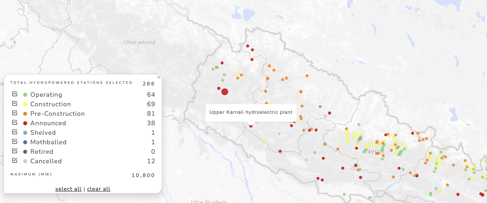
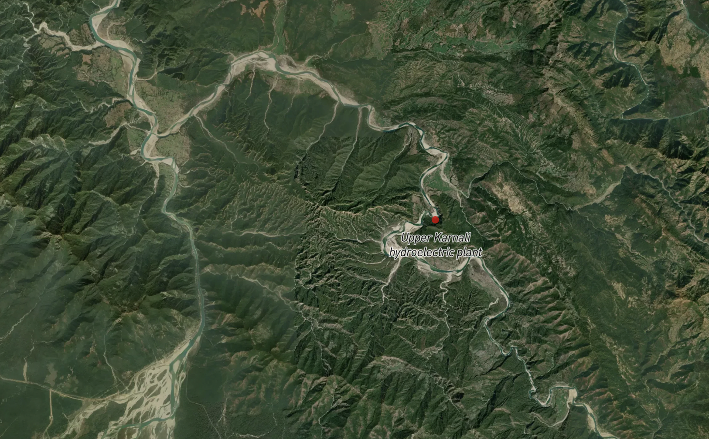

# Upper Karnali Hydropower - Transmission Lines Study
Designing a hypothetical 100km, 400kV double-circuit cross-border transmission network from the Upper Karnali Hydropower site in Western Nepal to the Indian border using Python-driven terrain and structural simulation.

## Background
The far-western regions of Nepal (Sudurpaschim and Karnali Provinces) are widely regarded as the least developed in the country due to the challenging geography, harsh climates, leading to isolation and high rates of poverty. However, these regions have huge hydropower potential due to rivers like Karnali and Mahakali, which are relatively unharnessed. Building infrastructure, particularly transmission lines, is a critical part of harnessing and delivering electricity in the region, and generating interest and investments for such large-scale projects. If these projects and transmission networks are successfully established, there is hope for socio-economic benefits for people in the region including industrialization, digital inclusion, revenue from cross-border trade, and economic opportunities for locals.

## The Upper Karnali Hydropower Site (900MW)
> The Upper Karnali Storage Hydropower Project is a proposed run-of-the-river hydroelectric plant on the Karnali river in West Nepal. It will have an installed capacity of 900 MW, making it the largest hydropower plant in Nepal when achieved [...] most of the generated power is set to be exported to both Bangladesh (about 500 MW) and India (another 292 MW), via a 400 kV double circuit transmission line, with the only remaining 108 MW of total power dedicated to local consumption.

> _Source: https://en.wikipedia.org/wiki/Upper_Karnali_Hydropower_Project_

 

 

_Maps from [Global Energy Monitor](https://globalenergymonitor.org/projects/global-hydropower-tracker?popup=3644)_

### Power Transmission and Off-take:
The power generated by the Upper Karnali hydropower project will be transmitted to the North East West Northern Eastern (NEWNE) India grid through a 400kV double-circuit transmission line. The 400kV export power is expected to be transmitted to the pooling station at Bareilly in Uttar Pradesh, owned by Power Grid Corporation of India (PGCIL). Nepal is entitled to receive 12% free power from the total power generated by the project, while 56% will be sold to Bangladesh under a long-term power purchase agreement (PPA). The remaining 32% will be sold to India under short-term/mid-term/long-term bilateral purchase agreements.

_Source: https://web.archive.org/web/20221023231005/https://www.nsenergybusiness.com/projects/upper-karnali-hydropower-project-nepal/_

## Purpose
The purpose of this study is to design a	100 km 400 kV double-circuit transmission line (up to the Nepal-India border) connecting the power generated at the Upper Karnali hydropower site to the Indian grid.

## Simulation & Analysis
The simulations will be performed using python (with the help of libraries like rasterio, numpy, matplotlib, shapely, and pyproj). The program will try to mimic the logic of industry tools like PLS-CADD.

### 1. Terrain Intake & Routing Strategy
The Upper Karnali powerhouse sits in a deep, rugged canyon at approximately 28.90° N, 81.44° E. To reach the plains of India, the transmission line needs to drop out of the Himalayan foothills (Siwalik/Churia range) and head down toward Terai (plains) near the India border.

As the first step, the digital elevation model (DEM) for Western Nepal from NASA's Global DEM dataset will be used to plot a 3D surface mesh of the 100km corridor. Then, Points of Intersection (PI) or angle points are selected to guide the route. 
Below is a list 5 coordinates connecting Upper Karnali to the border (hand picked using Google Earth):
1. x
2. y
3. z
4. a
5. b

The program foo.py is used to linearly interpolate between the PI coordinates to sample terrain elevations every 20 meters across the entire 100km span. In general, the routing strategy tries to navigate around mountains, avoid massive river wide-crossings where possible, and is directed south.

This results in the following 2D longitudinal terrain profile:

Dataset Source: NASA JPL (2021). <i>NASADEM Merged DEM Global 1 arc second V001</i>.  Distributed by OpenTopography. https://doi.org/10.5069/G93T9FD9. Accessed 2026-05-19

### 2. Conductor Selection & Sag-Tension Modelling
### 3. Automated Tower Spotting
### 4. Verification

## Conclusion
