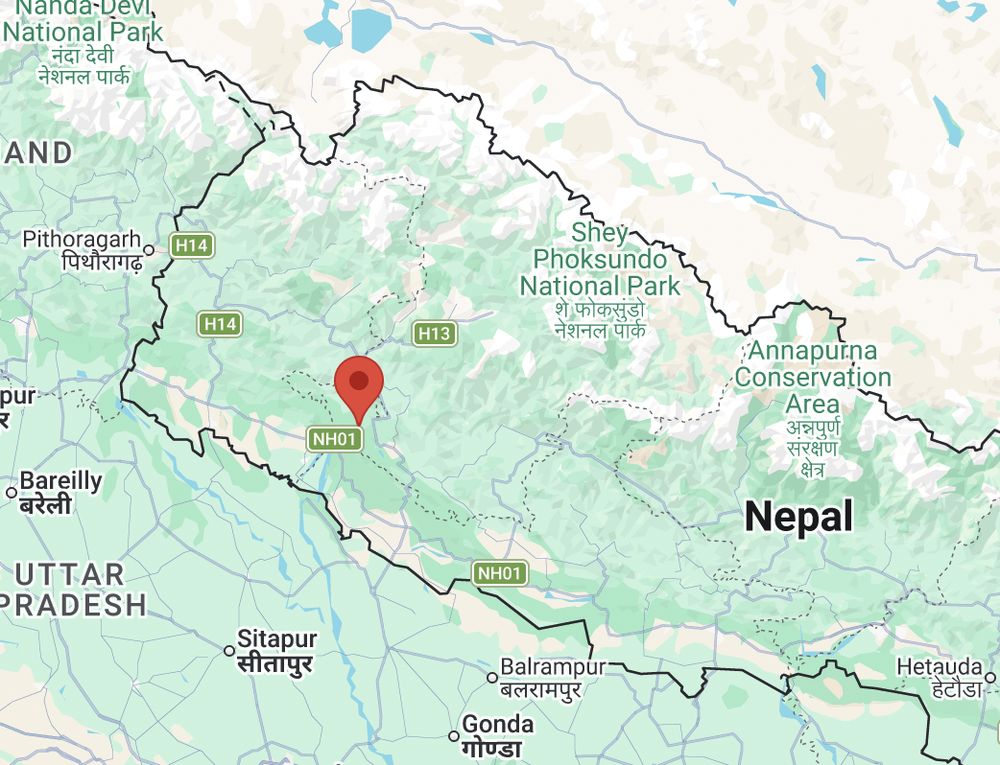

# Upper Karnali Hydropower - Transmission Lines Study

> The Upper Karnali Storage Hydropower Project is a proposed run-of-the-river hydroelectric plant on the Karnali river in Nepal. It will have an installed capacity of 900 MW, making it the largest hydropower plant in Nepal when achieved.[1] However, most of the generated power is set to be exported to both Bangladesh (about 500 MW) and India (another 292 MW), via a 400 kV double circuit transmission line, with the only remaining 108 MW of total power dedicated to local consumption.
> Source: https://en.wikipedia.org/wiki/Upper_Karnali_Hydropower_Project

 

## Background

> Power transmission and off-take:
The power generated by the Upper Karnali hydropower project will be transmitted to the North East West Northern Eastern (NEWNE) India grid through a 400kV double-circuit transmission line. The 400kV export power is expected to be transmitted to the pooling station at Bareilly in Uttar Pradesh, owned by Power Grid Corporation of India (PGCIL). Nepal is entitled to receive 12% free power from the total power generated by the project, while 56% will be sold to Bangladesh under a long-term power purchase agreement (PPA). The remaining 32% will be sold to India under short-term/mid-term/long-term bilateral purchase agreements.
Source: https://web.archive.org/web/20221023231005/https://www.nsenergybusiness.com/projects/upper-karnali-hydropower-project-nepal/
